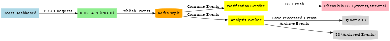

I have a react dashboard to do crud operation to products saved in a postgresql database. When I do crud operations via REST api calls, server publish events to kafka topic. There are two consumers listening to those topics notification service and analysis worker. Notification service consumes those events and send server send events to client side via /events/streams endpoint and analysis worker consumes them and save to a dynamo database as well as archived events to s3 sketch out a simple architecture diagram of my flow (React → REST API → Kafka → Consumers → Clients / DynamoDB / S3) so it’s visually clear

accepted 
---------


```
+----------------------+
|   React Dashboard    |
|  (Single Page App)   |
|----------------------|
| - Products Table     |
| - Product Modal      |
| - Notifications Panel|
+----------------------+
        |
        | REST API Calls (GET / POST / PUT / DELETE / /events/streams)
        v
+----------------------+
|  Backend API Server  |
|----------------------|
| - Products Controller|
| - Event Emitter      | |
+----------------------+
        |
        | SSE
        v
+----------------------+
| Notifications Panel  |
| Low-Stock Alerts     |
| Analysis worker      |
+----------------------+
```


