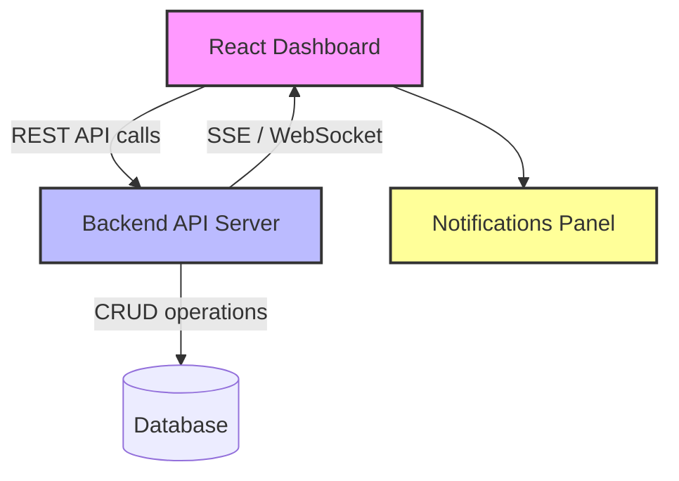

prompt - <openAPI.yml file> consider my openAPI.yml and draw a simple architecture diagram for a React dashboard using WebSocket for low-stock notifications, calling a REST API backend specified in openAPI.yml.

response - 

Perfect! Let’s visualize a **simple architecture diagram** based on your `openapi.yml`. Since your OpenAPI specifies a REST API backend and an **SSE endpoint for low-stock alerts**, we can represent the components clearly: frontend, backend, and event flow.

Here’s a textual diagram for clarity first:

```
+----------------------+
|   React Dashboard    |
|  (Single Page App)   |
|----------------------|
| - Products Table     |
| - Product Modal      |
| - Notifications Panel|
+----------------------+
        |
        | REST API Calls (GET / POST / PUT / DELETE / import/export)
        v
+----------------------+
|  Backend API Server  |
|----------------------|
| - Products Controller|
| - Event Emitter      |
| - CSV Import/Export  |
+----------------------+
        |
        | SSE / WebSocket Stream
        v
+----------------------+
| Notifications Panel  |
| Low-Stock Alerts     |
+----------------------+
```

Or in **diagrammatic form**:



**Explanation of Components and Flow:**

1. **React Dashboard (SPA)**

   * Contains **Products Table**, **Product Modal**, **Notifications Panel**.
   * Calls REST API for listing, creating, updating, deleting products.
   * Opens modal prefilled for edit, shows toast notifications for success/failure.

2. **Backend API Server**

   * Implements all endpoints in your OpenAPI:

     * `/products` (GET/POST)
     * `/products/{id}` (PUT/DELETE)
     * `/products/import`, `/products/export`
   * Emits **Server-Sent Events** (`/events/stream`) when low-stock alerts occur.

3. **Database**

   * Stores product data, with fields matching your `Product` schema (`id, sellerId, name, price, quantity, category, etc.`).

4. **Notifications Panel**

   * Subscribes to SSE/WebSocket events from `/events/stream`.
   * Displays real-time low-stock alerts.
   * React component listens and updates UI automatically.

---

If you want, I can also **draw a polished visual diagram** in an image format that you can directly include in your repo or documentation.

Do you want me to do that next?
